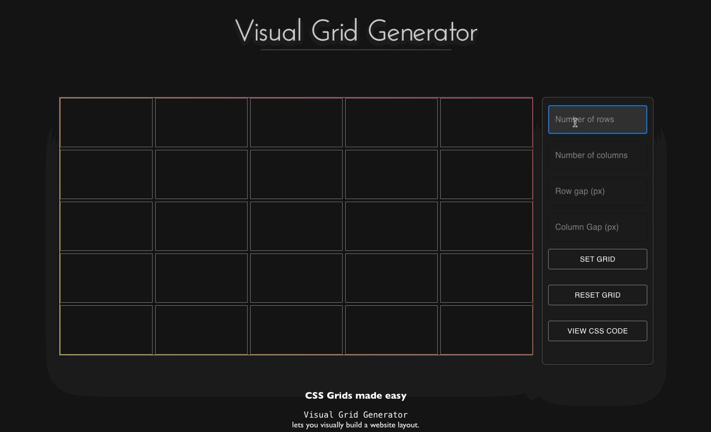

# Visual Grid Generator
### Go to the application
**https://visual-grid-generator.netlify.app/**

## CSS Grids made easy
Ever struggled with building layouts for your website?
 
**Visual Grid Generator** is the easiest and fastest way for web developers to create a CSS Layout.

With **Visual Grid Generator**, you can build your layouts visually, and generate the CSS code you need. 

* Build the layout by setting the number of rows and columns

* Select the areas where you want to insert your child elements by pressing down your left mouse button and dragging it. 

* Get the CSS code for the entire layout and all child elements.

Starting in web development, I found that setting grids with CSS could be confusing and complicated. 
 
The purpose of this application is to provide a way to start building grid layouts in an easy manner. 

To read more about CSS Grid Layouts, check out <a href="https://www.w3schools.com/css/css_grid.asp" alt="W3Schools" target="_blank">W3Schools</a>.
## Example
 

 

## Supported web browsers
Browsers currently supported include: 

* Chrome

* Firefox

## Development

This project was build with Javascript using <a href="https://reactjs.org/" target="_blank">React</a> version 18.2.0.
In the project directory, you can run:

### `npm install`

Installs all necessary dependencies for the project.

### `npm start`

Make sure to run npm install before running this script. 
Runs the app in the development mode.\
Open [http://localhost:3000](http://localhost:3000) to view it in your browser.

The page will reload when you make changes.\
You may also see any lint errors in the console.

### `npm test`

Launches the test runner in the interactive watch mode.\
See the section about [running tests](https://facebook.github.io/create-react-app/docs/running-tests) for more information.

## Contributing

Want to contribute?

* Fork the project on Github.
* Implement/fix your feature, comment your code. Follow the code style of the project, including indentation.
* Implement tests for new feature.
* Run tests.
* Create a pull request.
 
 
Copyright (c) 2022 Andreas Lillje
