## Reflektion

*Applikationen är driftsatt här*
 
https://visual-grid-generator.netlify.app/ 
 
Repositorium för L1:
 
https://github.com/alillje/gridlify
 

### Inledning
Inledningsvis vill jag påtala det uppenbara. 
Jag har använt ett front-end ramverk för att skapa gränssnittet för denna applikation.
Detta eftersom att jag har haft som mål att bygga en så bra _webbapplikation_ som möjligt på ändå den korta tiden vi har haft. 

En av reglerna för denna uppgift är att skriva objektorienterad kod, vilket inte har varit möjligt till 100% i mitt fall.
Det har varit en utmaning att med dessa förutsättningar skriva kod som är förståelig för andra utvecklare.

Min strategi har varit att försöka lägga "statisk" funktionalitet i Klasser, och bara det allra nödvändigaste i React-komponenter. 
Men genom att lägga så mycket funktionalitet som möjligt i klasser, tänker jag att tröskeln sänks för en annan utvecklare utan tidigare erfarenheter av ramverket React att sätta sig in i koden och ändå förstå så mycket som möjligt.
En stor utmaning har alltså varit att använda ett ramverk och ändå göra koden förståelig för utomstående. 

Jag har även i allra största mån använt mig av Clean Codes regler oavsett _var_ jag skriver koden. Exemplevis att ha metoder som är små och bara gör en sak, använda en hög nivå abstraktion i mina metoder/funktioner, och använda tydliga metod och variabelnamn.

Hur man än vrider och vänder på det krävs en del förkunskap av react för att helt förstå hur komponenterna fungerar då flödet är något annorlunda än att skriva koden i exempelvis Webbkomponenter med VanillaJS. 
Då jag har erfarenhet av båda teknikerna, inser jag att även om detta är ett ramverk, så blir koden mycket tydligare och lättläst, i synnerhet om man arbetar med reglerna som finns beskrivna i kurslitteraturen. 

Mina rena Javascript-klasser ligger i en egen map `./src/classes`

Den största delen av Javascript som finns i React-komponenterna finns i `./src/components/grid-displayer/grid-displayer.js`
I början av denna komponent (GridDisplayer) sätts ett antal konstanter, något som är nödvändigt i detta fall då jag jobbar med React, men ser man förbi det, hoppas jag att man kan titta på metoderna i komponenterna och förstå vad de gör och att jag lagt ned mycket tid till att fundera på hur detta ska framställas så enkelt som möjligt och hur jag har försökt att jobba på en hög abstraktionsnivå.

Mitt paket från L1, `gridlify` (https://github.com/alillje/gridlify), används i `./src/classes/child-element-controller.js` samt i `./src/components/grid-displayer/grid-displayer.js`.

### Krav
Alla krav finns beskrivna i `./src/release/requirements.md` 

### Testning
Alla automatiska tester, alla manuella test-fall och testrapport finns att hitta i `./src/release/test-specification.md` samt `./src/release/test-report`.

## Clean Code

### Kapitel 2
Jag har jobbat med att använda **Intention-Revealing names** i största möjliga mån. 
Det har känts extra viktigt när jag har jobbat i ett front-end ramverk. 

Detta gör namnen aningen långa, längre än jag tidigare velat ha metod och variabelnamn. Men efter att ha reflekterat över saken har jag kommit fram till att, så länge jag håller mig till namn som följer **Use Pronouncable Names**, så finns det flera mervärden att ha självförklarande namn. 
De hjälper en att förstå vad funktionen gör utan att behöva läsa kommentarer, och de gör att metoderna/variablerna följer regeln för **Use Searchable Names**, vilket kan göra det lättare att navigera i koden. Givetvis är det en balansgång, och jag inser att det finns en gräns för hur långt ett namn bör vara. Detta är en avvägning man får göra i fall till fall.

Exempel:
 
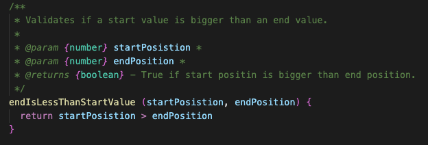
 

### Kapitel 3

En utmaning när man jobbar med Javascript i webbläsaren att få till en hög nivå av abstraktion i vissa metoder där man måste använda sig av `document´-objektet i vissa operationer.

Exempel: 

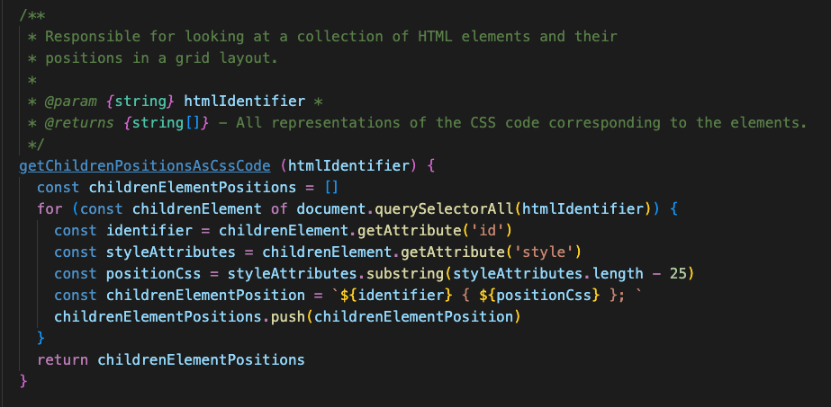
 
I mina ögon är denna metod för lång, men alternativet ser ut som någonting i stil med detta:
 
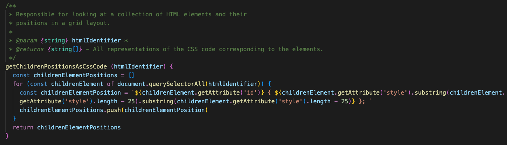
 

Detta inträffar på ett antal ställen i min kod, och även om jag jobbar med att höja abstraktionsnivån i de allra flesta metoder, måste denna typen av kod ligga någonstans.
Jag föredrar i dessa fall att skapa lokala variabler, för ökad _readability_, och kompromissar alltså bort regeln _small_.
I ovan exempel har jag även försökt **Use Descriptive Name**, vilket som tidigare nämnts är fallet genomgående i hela kodbasen.

### Kapitel 4
Jag använder inga radkommentarer överhuvudtaget i detta projekt. 
Min målsättning är och har varit att **Explain Yourself in Code**.
Alltså, 

Jag använder dock JSDocs till alla mina metoder. Efter att ha läst boken märker jag hur jag inte behöver skriva lång förklaringar ovanför varje metod, utan bara kortare beskrivningar, som i ärlighetens namn även de kan kännas överflödiga.

Så dessvärre använder jag mig i mitt tycke i vissa fall av **Redundant comments**, som tar längre tid att läsa än själva koden. 

Min känsla är dock att jag har utvecklats på detta och försöker har förklaringar så korta som möjligt och inte förklara samma sak som koden själv är menad att förklara. 

Jag försöker använda kommentarerna för att förklara typer och argument för att underlätta för utvecklare som ska använda metoden efter mig. 

Jag har slutat skriva förklaringar till parametrar som är självförklarande. 
Exempel:

 
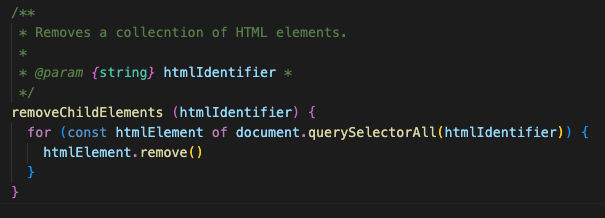
 

### Kapitel 5
För att bibehålla en god struktur på koden, använder jag mig av en automatisk formaterare, precis som föreslås i boken. 

När jag själv läser kod tycker jag att de viktigaste sakerna är **Vertical Density** , **Vertical Distance** , **Indentation**.

Dessa parametrar gör koden mycket "luftigare" och _extremt_ mycket lättare/effektivare att läsa.

Har även haft som målsättning att följa regeln för **Dependant Functions**, och lägga funktioner som är beroende av varandra så nära varandra som möjligt, för att undvika att man ska behöva leta eller söka efter en funktion som kallas inuti en annan. 

Nedan är ett exempel på alla koncept från boken som tagits upp i min reflektion för kapitel 5: 
 
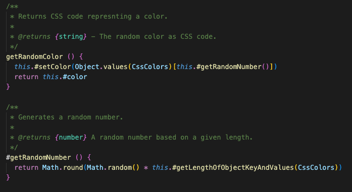
 

### Kapitel 6
Mina klasser är inte strukturerade som **Data Structures**, utan för att instansieras med objekt, som döljer sin data, men visar beteenden (I form av metoder). 

Exempel:
 
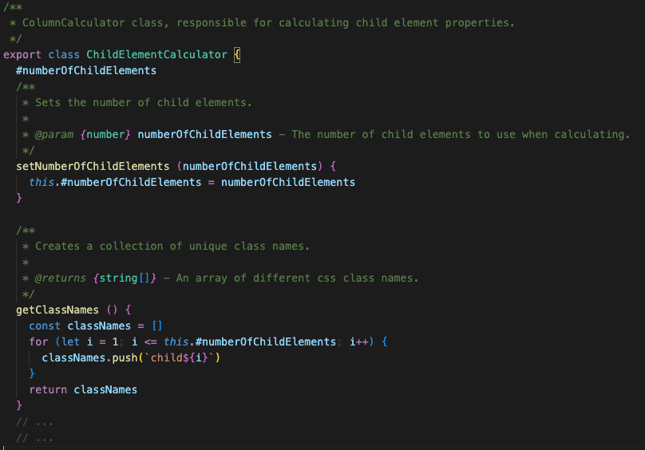
 

Jag har en enum-modul som skulle kunnan anses vara en datastruktur, då dess enda uppgift är att hålla värden.

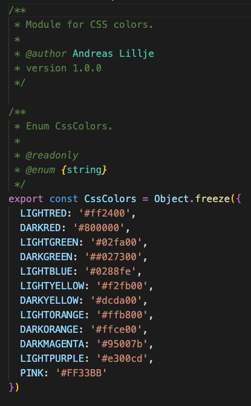
 

### Kapitel 7
Jag hanterar fel i form av användarinput där jag validerar om det är nummer och antal rader och kolumner. 
Jag skrev från början felhanteringen med endast if..else-satser, men efter att ha reflekterat och läst om kapitlet i boken ändrade jag i koden, där jag istället för att returnera true/false från metoderna som validerar, så kastar jag undantag i validerings-metoderna, för att sedan fånga felet med try..catch. 
Detta alltså enligt **Use Exceptions Rather Than Return Codes**.

Resultatet blev ca. 50 rader mindre kod och kod som blev betydligt enklare att läsa enligt nedan:

 
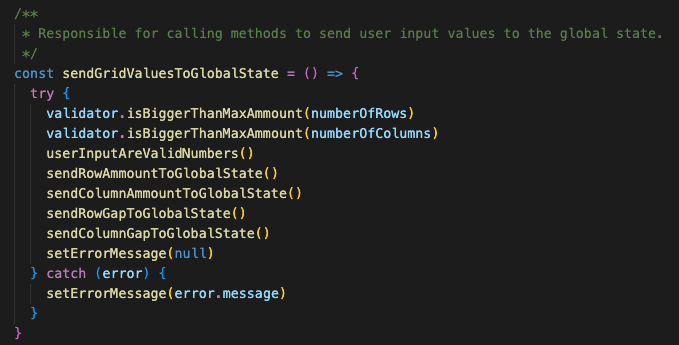
 
*./src/components/grid-displayer/grid-displayer.js*
 
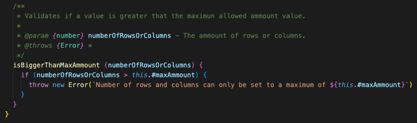
 

*./src/classes/validator.js*

### Kapitel 8
De mest uppenbara **Boundries** har varit detta projekts beroende av biblioteket `React`. 

Detta har som tidigare nämnts varit en ganska stor utmaning, jag har haft en idé klar sedan jag skrev mitt bibliotek i den tidigare laborationen i denna kurs. 

Jag har tampats med att skriva objektorienterad kod i med ett funktionellt programmeringsspråk. 

Jag fick länge fundera över hur jag skulle tackla detta problem, och jag tycker att jag har hittat en mellanväg som fungerar. 
Min upplevelse är att jag faktiskt använder mig av Clean Boundaries, då min objektorienterad kod är strukturerad i klasser, som inte har något beroende till `React`. 
Då jag tidigare har skrivit i `React` har detta inte varit någonting jag behövt ta någin hänsyn till, men efter att ha gjort på det här sättet, flytta ut så mycket funktionalitet som möjligt till fristående klasser, oberoende av *third-party*-biblioteket, har jag faktsiskt skapat **Clean Boundaries**. 

Detta gör även att koden som är skriven i mina klasser kan återanvändas i vilken miljö som helst. 

Exempel där jag använder mig av min oberoende kod i en React-komponent (RowCalculator och ColumnCalculator är instanser av mina klasser):
 
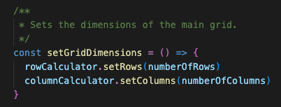
 
*./src/components/grid-displayer/grid-displayer.js*

### Kapitel 9
Jag testar alla publika metoder i mina klasser. 
Jag kan direkt säga att jag inte följer alla 3 regler ur *Test Driven Development*, speciellt inte regel nummer 1. *Att skriva tester innan jag skriver koden*. Det är dock någonting att sträva mot, och jag är glad att jag tagit mig tid att träna på att skriva tester så tidigt som möjligt i utvecklingen. *Att skriva tester

Jag skriver "rena" enhets tester, enligt **Clean Tests**.
Eftersom *Readability* enligt litteraturen är den största faktorn när man skriver enhetstester, har jag fokuserat på detta, och anser att jag har lyckets bra. 

Jag har använt testramverket `jest` för att skriva mina enhetstester.

I mina ögon är testerna självförklarande.

Exmpel:
 
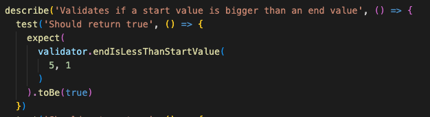
 

### Kapitel 10
I de fall jag har fält i mina klasser använder jag inga publika fält. 
De är privata och i de fallen jag behöver hämta ett värde har jag implementerat getters.

Enligt **Encapsulation** gör jag endast metoder som måste kunna användas utanför klassen publika, i annat fall är de privata. 

Exempel:
 
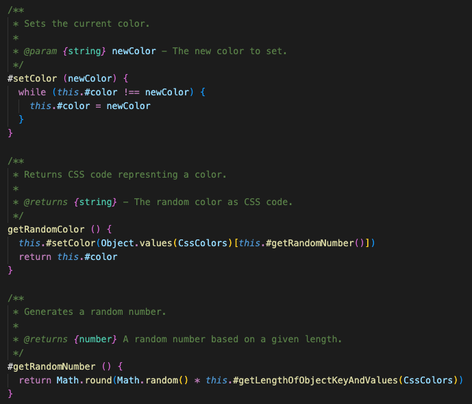
 
*I Javascript skrivs privata fält och metoder med ett # framför*

**Classes should be small**
Mina klasser kan inte anses vara stora, jag har försökt dela upp de beroende på ansvarsområde. 

### Kapitel 11
Min systemarkitektur är ren och uppdelad. 

Jag har som tidigare nämnts separerat beroendet av react helt från mina POJOs (Pure Old Javascript Classes).

Jag använder på alla sätt och vis **Optimize Decision Making**, och separation of concerns, på ett objektorienterat sätt, både i mina klasser och i mina React-komponenter som jag försöker skriva med ett objektorienterat tänk.

Varje klass eller komponent ska inte ha för mycket ansvar och ansvarar för **Descision Making** i sin egen del av systemet. 

