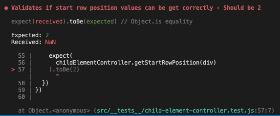
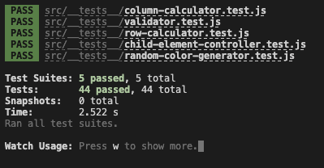
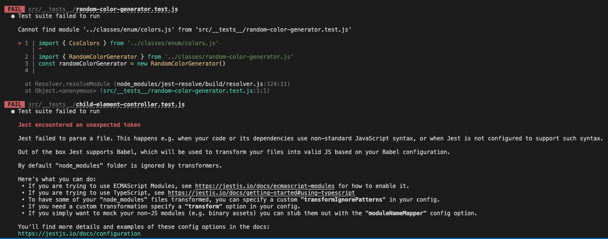
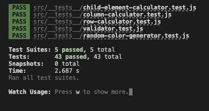
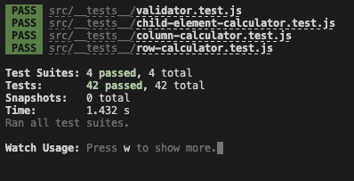
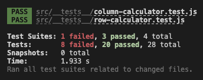
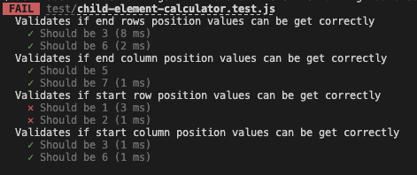
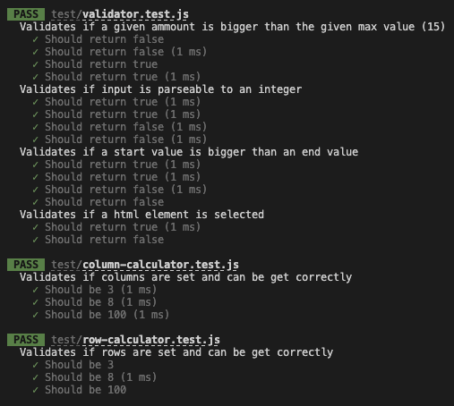
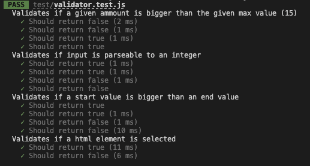

# Test Report

*NOTE: Här har jag sedan tidigare skrivit krav, testspecifikation och testrapporter på engelska och infogar de därför som de är nedan.*

Jag har ställt upp krav, beskrivit i testspecifikationen vilka testfall som testar vilka krav.
Jag har använt automatisk och manuelt testning. Nedan beskrivs krav, testspecifikation och testrapporter

## Manual testning
### Test Suite 4
* Date 14/10 2022
* Version (git commit hash) 9477e218262d35d81fe5b28d6030f328810eca3a

#### Notes
- Fix the bug that mad TC8.1 & TC8.2 fail in the previous test suite. All manual tests now PASS. 

| Test      | 1 |
| --------- |:----:|
| TC1.1     | OK |
| TC1.2     | OK |
| COVERAGE & SUCCESS   | 2/2 OK 

| Test      | 2 |
| --------- |:----:|
| TC2.1     | OK |
| TC2.2     | OK |
| COVERAGE & SUCCESS   | 2/2 OK 

| Test      | 3 |
| --------- |:----:|
| TC3.1     | OK |
| TC3.2     | OK |
| COVERAGE & SUCCESS   | 2/2 OK 

| Test      | 4 |
| --------- |:----:|
| TC4.1     | OK |
| TC4.2     | O |
| COVERAGE & SUCCESS   | 1/2 OK 

| Test      | 5 |
| --------- |:----:|
| TC5.1     | OK |
| TC5.2     | OK |
| COVERAGE & SUCCESS   | 2/2 OK

| Test      | 6 |
| --------- |:----:|
| TC6.1     | OK |
| TC6.2     | OK |
| TC6.3     | OK |
| TC6.4     | OK |
| COVERAGE & SUCCESS   | 4/4 OK

| Test      | 7 |
| --------- |:----:|
| TC7.1     | OK |
| TC7.2     | OK |
| COVERAGE & SUCCESS   | 2/2 OK

| Test      | 8 |
| --------- |:----:|
| TC8.1     | OK |
| TC8.2     | OK |
| TC8.3     | OK |
| COVERAGE & SUCCESS   | 3/3 OK

| Test      | 9 |
| --------- |:----:|
| TC9.1     | OK |
| TC9.2     | OK |
| TC9.3     | OK |
| TC9.4     | OK |
| COVERAGE & SUCCESS   | 4/4 OK

### Test Suite 3
* Date 14/10 2022
* Version (git commit hash) 6cfaee85844e86536497cdbb8986e37591f0ca4f

#### Notes
- TC8.1 & TC8.2 FAILS. User is able to select from right to left and down to up with should not be possible.

| Test      | 1 |
| --------- |:----:|
| TC1.1     | OK |
| TC1.2     | OK |
| COVERAGE & SUCCESS   | 2/2 OK 

| Test      | 2 |
| --------- |:----:|
| TC2.1     | OK |
| TC2.2     | OK |
| COVERAGE & SUCCESS   | 2/2 OK 

| Test      | 3 |
| --------- |:----:|
| TC3.1     | OK |
| TC3.2     | OK |
| COVERAGE & SUCCESS   | 2/2 OK 

| Test      | 4 |
| --------- |:----:|
| TC4.1     | OK |
| TC4.2     | O |
| COVERAGE & SUCCESS   | 1/2 OK 

| Test      | 5 |
| --------- |:----:|
| TC5.1     | OK |
| TC5.2     | OK |
| COVERAGE & SUCCESS   | 2/2 OK

| Test      | 6 |
| --------- |:----:|
| TC6.1     | OK |
| TC6.2     | OK |
| TC6.3     | OK |
| TC6.4     | OK |
| COVERAGE & SUCCESS   | 4/4 OK

| Test      | 7 |
| --------- |:----:|
| TC7.1     | OK |
| TC7.2     | OK |
| COVERAGE & SUCCESS   | 2/2 OK

| Test      | 8 |
| --------- |:----:|
| TC8.1     | FAIL |
| TC8.2     | FAIL |
| TC8.3     | OK |
| COVERAGE & SUCCESS   | 1/3 OK

| Test      | 9 |
| --------- |:----:|
| TC9.1     | OK |
| TC9.2     | OK |
| TC9.3     | OK |
| TC9.4     | OK |
| COVERAGE & SUCCESS   | 4/4 OK

### Test Suite 2
* Date 13/10 2022
* Version (git commit hash) ea4c16bdfc19e64623203bab7c096908d10c10c6

#### Notes
- All tests passed successfully

| Test      | 1 |
| --------- |:----:|
| TC1.1     | OK |
| TC1.2     | OK |
| COVERAGE & SUCCESS   | 2/2 OK 

| Test      | 2 |
| --------- |:----:|
| TC2.1     | OK |
| TC2.2     | OK |
| COVERAGE & SUCCESS   | 2/2 OK 

| Test      | 3 |
| --------- |:----:|
| TC3.1     | OK |
| TC3.2     | OK |
| COVERAGE & SUCCESS   | 2/2 OK 

| Test      | 4 |
| --------- |:----:|
| TC4.1     | OK |
| TC4.2     | O |
| COVERAGE & SUCCESS   | 1/2 OK 

| Test      | 5 |
| --------- |:----:|
| TC5.1     | OK |
| TC5.2     | OK |
| COVERAGE & SUCCESS   | 2/2 OK

| Test      | 6 |
| --------- |:----:|
| TC6.1     | OK |
| TC6.2     | OK |
| TC6.3     | OK |
| TC6.4     | OK |
| COVERAGE & SUCCESS   | 4/4 OK

| Test      | 7 |
| --------- |:----:|
| TC7.1     | OK |
| TC7.2     | OK |
| COVERAGE & SUCCESS   | 2/2 OK

| Test      | 8 |
| --------- |:----:|
| TC8.1     | OK |
| TC8.2     | OK |
| TC8.3     | OK |
| COVERAGE & SUCCESS   | 3/3 OK

| Test      | 9 |
| --------- |:----:|
| TC9.1     | OK |
| TC9.2     | OK |
| TC9.3     | OK |
| TC9.4     | OK |
| COVERAGE & SUCCESS   | 4/4 OK

### Test Suite 1
* Date 12/10 2022
* Version (git commit hash) 99989e6f155845bcdc3134cd7ff46da7432a8217

#### Notes
- TC4.2 Fails. It does not show the correct gap values for the set grid. Furhter investigation to find bug needed.

| Test      |  |
| --------- |:----:|
| TC1.1     | OK |
| TC1.2     | OK |
| COVERAGE & SUCCESS   | 2/2 OK 

| Test      |  |
| --------- |:----:|
| TC2.1     | OK |
| TC2.2     | OK |
| COVERAGE & SUCCESS   | 2/2 OK 

| Test      |  |
| --------- |:----:|
| TC3.1     | OK |
| TC3.2     | OK |
| COVERAGE & SUCCESS   | 2/2 OK 

| Test      |  |
| --------- |:----:|
| TC4.1     | OK |
| TC4.2     | OK |
| COVERAGE & SUCCESS   | 2/2 OK 

| Test      |  |
| --------- |:----:|
| TC5.1     | OK |
| TC5.2     | OK |
| COVERAGE & SUCCESS   | 2/2 OK

## Automatic Unit Tests

### Test suite 7
* Date 14/10 2022
* version (git commit hash) 8237dc5ecb34d50d05f632fccda66e64134dd8a3

*Notes:* Test fails, further investigation.

</img>

### Test suite 7
* Date 14/10 2022
* version (git commit hash) 6cfaee85844e86536497cdbb8986e37591f0ca4f

*Notes:* Fixed the test script that was run and threw an error in last test suite. Implemented new tests for new methods.

</img>

### Test suite 6
* Date 14/10 2022
* version (git commit hash) e53ed4eed609231951e1e276c609ce50f69e08d5

*Notes:* After code refactoring, i ran the test suite. Failed some test. Will investigate and report.

</img>

### Test suite 5
* Date 13/10 2022
* version (git commit hash) d4c3643e578eefc66ef0067ec1190a3b7c1b4d96

*Notes:* Add more tests.

</img>

### Test suite 4
* Date 13/10 2022
* version (git commit hash) e7c6939e1ee16c4a987ce96f70dc2f31335b5a46

*Notes:* Fix tests that previously failed, added more unit tests.

</img>

### Test suite 3
* Date 13/10 2022
* version (git commit hash) ea4c16bdfc19e64623203bab7c096908d10c10c6

*Notes:* Refactor some functions that now fail their tests, need to re-implementerat these tests to the new code.

</img>

### Test suite 2
* Date 12/10 2022
* version (git commit hash) 914719f6298e6dd50e7a67de3198b93f31301958

*Notes:* Added more unit tests. Two test suites fail, need further investigation.

</img>
</img>

### Test suite 1
* Date 12/10 2022
* version (git commit hash) 07b1b94e943c3e905cd13fb4c5d29deba91db3b3

*Notes:* - 

</img>