## Test specification

### Automatic Unit tests
_________

Automatic unit tests are defined in the `test`-folder, in the root of the project.

The automatic unit test, tests the following requriements:

* Example req
* Example req
* Example req

### Manual Tests
_________

*Prerequisites*
If not already done, run the `npm install`command in the terminal.

In development, start the application by running the `npm start` command in the terminal.

*Note: The requriement tested is presented along with each test case.*

## TC1 Setting a grid with correct input (numbers)

* (Requirements 1, 2)

### TC1.1
*INPUT*
 
1. In the right hand menu, enter the following values and press *SET GRID* as follows: 
 
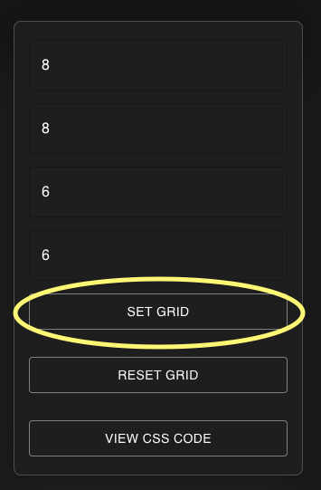

*OUTPUT*
1. The main grid area should look as follows:
 
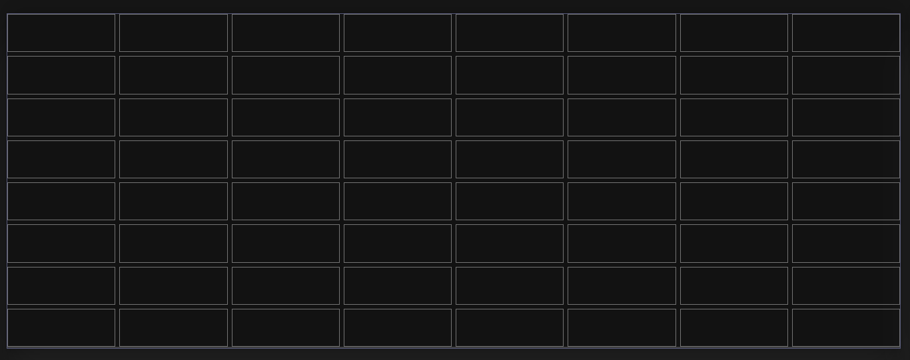

### TC1.2
*INPUT*
 
1. Press `RESET GRID`
2. In the right hand menu, enter the following values and press *SET GRID* as follows: 
 
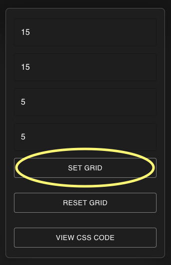

*OUTPUT*
1. The main grid area should look as follows:
 
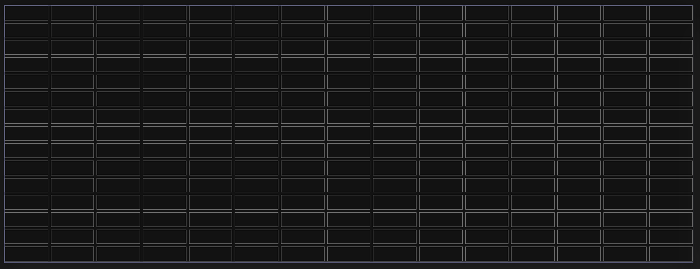

## TC2 Selecting an area 

* (Requirements 3)

### TC2.1
*INPUT*
1. Press `RESET GRID`
2. Press down the mouse on the first cell. (Position: Row 1, Column 1)
3. Keep the mouse pressed down and drag the mouse pointer to cell (Position Row 3, Column 3) and release the mouse button.

*OUTPUT*
1. An area should have been selected, looking as follows (color of the selected area may differ):
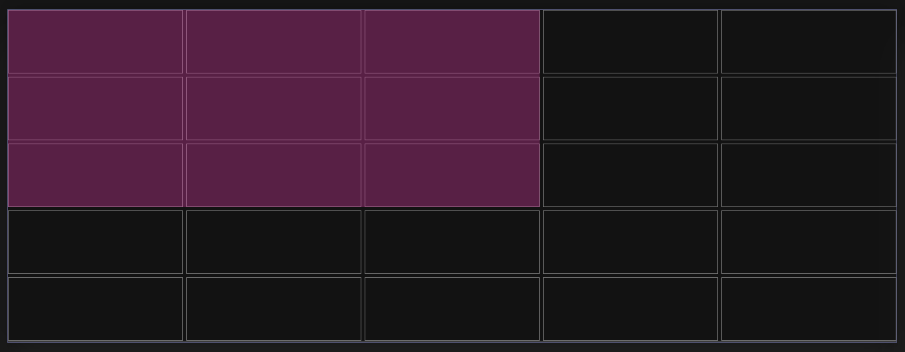

### TC2.2
*INPUT*
1. Press `RESET GRID`
2. TC1.1
2. Press down the mouse on the cell (Position Row 4, Column 5)
3. Keep the mouse pressed down and drag the mouse pointer to cell (Position Row 7, Column 6) and release the mouse button.

*OUTPUT*
1. An area should have been selected, looking as follows:
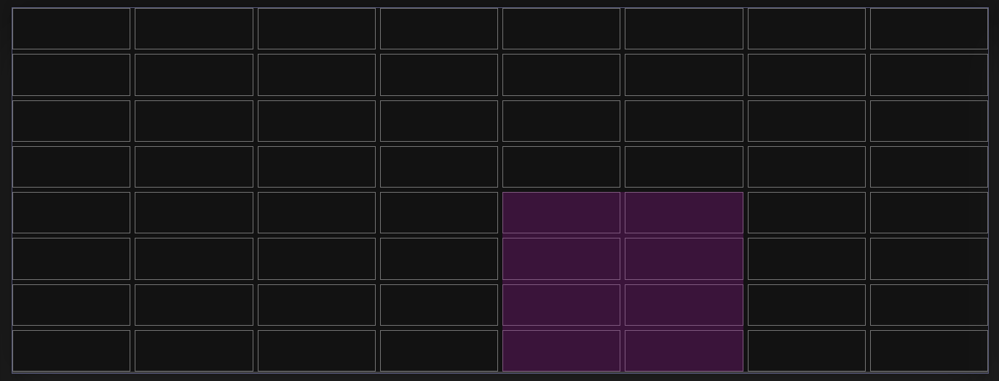

## TC3 Selecting multiple areas

* (Requirements 3)

### TC3.1
*INPUT*
1. Press `RESET GRID`
2. Press down the mouse on the cell (Position Row 2, Column 1)
3. Keep the mouse pressed down and drag the mouse pointer to cell (Position Row 5, Column 1)
4. An area should have been selected
5. Press down the mouse on the cell (Position Row 1, Column 1)
6. Keep the mouse pressed down and drag the mouse pointer to cell (Position Row 1, Column 5) and release the mouse button.

*OUTPUT*
1. 2 areas should have been selected, looking as follows:
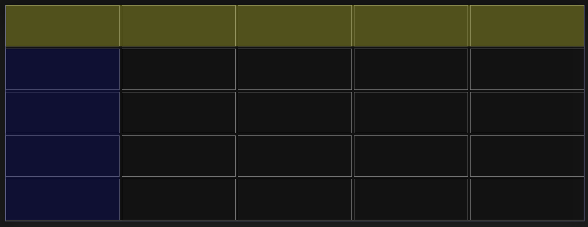

### TC3.2
*INPUT*
1. Press `RESET GRID`
2. TC1.1
3. Press down the mouse on the cell (Position Row 2, Column 1)
4. Keep the mouse pressed down and drag the mouse pointer to cell (Position Row 8, Column 2)
5. An area should have been selected
6. Press down the mouse on the cell (Position Row 1, Column 1)
7. Keep the mouse pressed down and drag the mouse pointer to cell (Position Row 1, Column 8) and release the mouse button.
8. Another area should have been selected
9. Press down the mouse on the cell (Position Row 2, Column 3)
10. Keep the mouse pressed down and drag the mouse pointer to cell (Position Row 8, Column 8) and release the mouse button.

*OUTPUT*
1. 3 areas should have been selected, looking as follows:
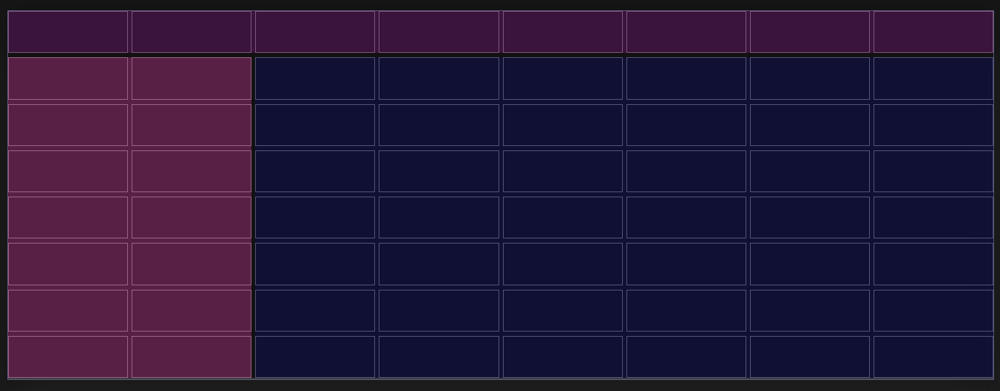

## TC4 Generating CSS code

* (Requirements 4)

### TC4.1
*INPUT*
1. Press `RESET GRID`
2. TC3.1
3. Press `VIEW CSS CODE`

*OUTPUT*
1. A pop-up window should appear with the corresponding CSS code, as follows:
 
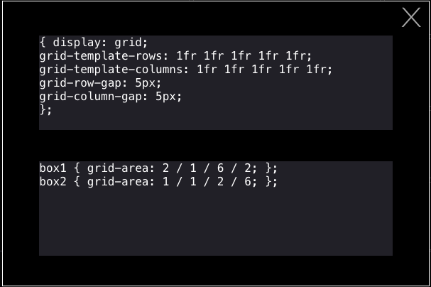

### TC4.2
*INPUT*
1. Press `RESET GRID`
2. TC3.2
3. Press `VIEW CSS CODE`

*OUTPUT*
1. A pop-up window should appear with the corresponding CSS code, as follows:
 
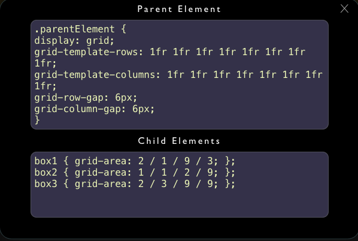

## TC5 Resetting settings

* (Requirements 5)

### TC5.1
*INPUT*
1. TC3.2
2. Press `RESET GRID`

*OUTPUT*
1. The grid should be reset to its initial state, as follows:
 
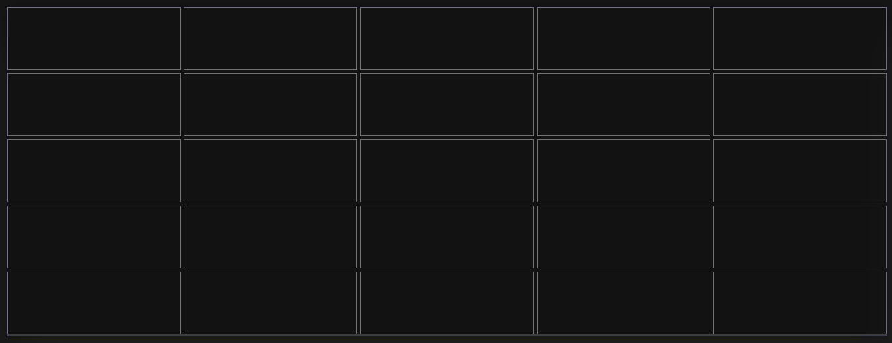
2. The menu should be reset to its initial state, as follows:
 
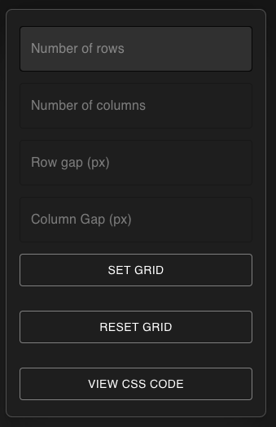

## TC5 Selecting an already selected area

* (Requirements 6)

### TC2.1
*INPUT*
1. Press `RESET GRID`
2. Press down the mouse on the first cell. (Position: Row 1, Column 1)
3. Keep the mouse pressed down and drag the mouse pointer to cell (Position Row 3, Column 3) and release the mouse button.
4. An area should be selected.
5. Press down the mouse on the first cell. (Position: Row 1, Column 1)
6. Keep the mouse pressed down and drag the mouse pointer to cell (Position Row 3, Column 3) and release the mouse button.

*OUTPUT*
1. A new selection should not have been created on top of the first one.

### TC2.2
1. Press `RESET GRID`
2. Set number of rows to 7
3. Set number of rows to 6
4. Set row gap to 1
5. Set column gap to 3

2. Press down the mouse on the cell (Position: Row 1, Column 1)
3. Keep the mouse pressed down and drag the mouse pointer to cell (Position Row 4, Column 4) and release the mouse button.
4. An area should be selected.
5. Press down the mouse on the first cell. (Position: Row 1
4, Column 1)
6. Keep the mouse pressed down and drag the mouse pointer to cell (Position Row 3, Column 3) and release the mouse button.

*OUTPUT*
1. Only one area (the first) should be selected.

